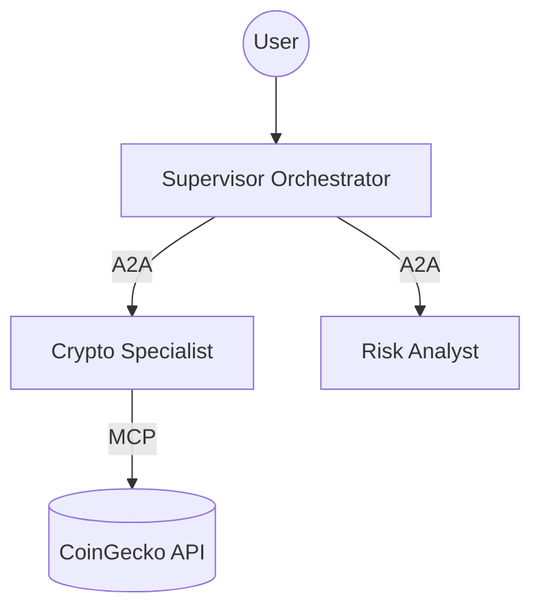

# Crypto Risk Arbitrator — Multi-Agent System

A professional multi-agent investment analysis platform built with [Google ADK](https://adk.dev), using the **Agent-to-Agent (A2A)** protocol and **Model Context Protocol (MCP)**.

## 🏗 Architecture



## 🚀 Quick Start

### Local Execution (Full Stack)
The easiest way to run the entire system locally is using the provided automation script:

```bash
# Set your API Key
export GOOGLE_API_KEY="your-gemini-api-key"

# Run all services (MCP, Specialists, and Supervisor Web UI)
./run_local.sh
```
The **Supervisor Web UI** will be available at [http://localhost:8005](http://localhost:8005).

### Automated Cloud Deployment
To deploy the entire system to Google Cloud Run:

```bash
export GOOGLE_API_KEY="your-gemini-api-key"
./deploy.sh
```

## 📂 Project Structure

| Component | Path | Purpose |
| :--- | :--- | :--- |
| **Root** | `.` | Global configuration and orchestration scripts. |
| **Supervisor** | `agents/supervisor` | System orchestrator and Web UI. |
| **Crypto Agent** | `agents/crypto-specialist` | Specialist for real-time market data. |
| **Risk Agent** | `agents/risk-analyst` | Specialist for quantitative risk scoring. |
| **MCP Server** | `mcp-server` | External tool bridge for CoinGecko. |

## 🛠 Tech Stack
- **Framework:** Google ADK (Agent Development Kit) 2.0
- **Communication:** A2A (Agent-to-Agent) & MCP (Model Context Protocol)
- **Deployment:** Docker + Google Cloud Run + Cloud Build
- **Language:** Python 3.14 + uv

## 📝 Documentation
- **[Agents Deep Dive](./agents/README.md)**: Details on agent logic and inter-agent communication.
- **[Design Spec](./docs/spec.md)**: Original architectural requirements.
